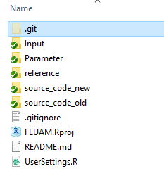
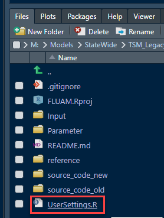
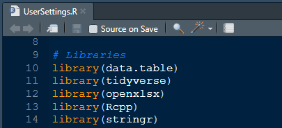
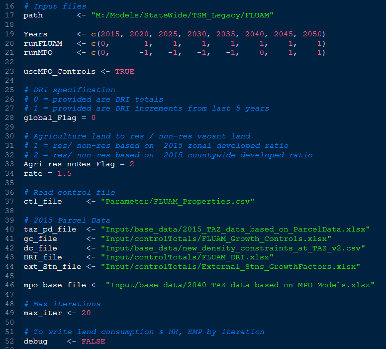

# FLUAM 3.0
[1. Introduction](#Introduction)  
[2. History](#History)  
[3. New Codebase](#Codebase)    
[4. Setup](#SetupInstallation)  
[5. User Guide](#UserGuide)  

---
## Introduction
FLUAM: The repo is about Florida Land Use Allocation Model
The model was originally developed by RSG back in mid 90's and later in mid 2000's (2006 - 2007) was implemented to FL under FTE. The 2007 implementation is referred as FLUAM.
Between 2007 and 2009, the model was updated a few times.  Now the same code is brought into R and with some C++ functionality as required.  

## History
v1.0.0.0 = FLUAM estimated with aggregate historical data  
v2.0.1.0 = FLUAM estimated with disaggregated data in specified counties  
v2.1.1.0 = FLUAM which also exports FRATAR input file  

Versions :
Nov,  1994: LUAM Concept  
April 2006: v1.0   Florida Land Use Allocation (Adoption)  
June 2007: v2.0   FLUAM from Parcel Data  
Sept 2007: v2.0.1 County Specific Inputs  
July 2009 : v2.1.1 exports FRATAR input file  
Nov 2019: v2.1 FLUAM new codebase in R & C++

FLUAM v3.0 is a slightly revised logic to allocated any un-allocated as re-development.  

---

## Codebase
New codebase written in RCPP (R & C++), basically R but have C++ functions embedded for computationally intense parts. One example is finding the closest ramp node to every TAZ.

FLUAM 3.0 runs all years, updates land consumption and developed area, based on allocated HH, EMP. Also, converts agriculture land at user-defined per annum rate to available land for consumption for next 5 years. The outputs include a detailed spreadsheet of land allocation along with trip ends growth factor used as FRATAR Inputs for TranPlan.

### Bug fixes (from FLUAM 2.1):
1. Code fix for closest 100 zones: Averages travel times are now computed for the closets 100 zones (note the definition of “closest” is “time” and not “distance” from the skim).
2. Link data fix: The attribute to identify facility types and distance to ramps are corrected. The original code uses field position to identify facility types and the input supplied was area type at that field. The new code uses field names instead of position.
3. Accessibility measure: Two accessibilities are now computed for every run. The original approach assumed base_accessibility (2015_skim * 2015_hh_emp)  as user input and computes future_accessibility (2020_skim * 2015_hh_emp) and for the next iteration (year 2020) base_accessibility (2020 * 2015_hh_emp)  and the future_accessibility is computed as (2025 * 2020_hh_emp). Since base accessibility is not computed every time a discrepancy was introduced in computing the “change on accessibility” measure.
4. Residential Developed Area: There is not much guidance on how this is updated year after year. For instance, say in 2015 we have “h” household and “r” acres of developed land and we estimate “h2020” for year 2020, but we don’t update residential land ‘r’ to account for new housing. Basically, we need a new “r2020” and reduce “vacant available” land.
5. Rounding Issue:  The previous code computes HH, EMP as doubles (decimals) but outputs as integers for the next iteration. This resulted in inconsistent Input / Output data between the two successive years.

### New features:
1. **Automator** to run all years (pairwise runs).
2.  **Agriculture Conversion**: In the very original document, it mentioned about statewide conversion at 1.5% per annum. The TAZ allocation of that is based on probabilities computed based on computed accessibility (fut_accessibilties) with capping to max allowable. The new codebase uses the same logic to update available land use for each year and reducing agriculture land. The new code base includes the “agriculture land” category.
3. **Developed Land**: To address “Bug #4”,  new allocated HH per TAZ and computed area based on zone’s computed internal density (by category) or max density constraint (input supplied by category). The allocated hh, emp to “available” land is re-categorized as “developed”.
4. **Available Land**: From New Features #2 & #3, we compute vacant land on the fly from agriculture land and use it to allocate new housing and then compute and categorize land consumed by new housing as “developed” (take it out of “vacant” for the next iteration).
5. **DRI Zones**: The zone becomes invisible for allocation and whatever is supplied in DRI shall be the final output. This is a deviation from the original “v2.1” logic where DRI zones are available for allocation plus adds user-defined DRI data.  There are two ways to specify this input as "increment" or "absolute" and in both cases, no natural growth is allowed.
6. **Consistent I/O Formats**: To fix Bug #5, the I.O formats are set the same to decimals. The only output rounded are FRATAR growth factors (for use in Tranplan).

### Fix Input Data Issues:
1. **Parcel Data**:  We found more issues with the parcel data that resulted in the wrong categorization of land in places where it is completely built-out. The team (Mindy, Justin & Amar) has reprocessed parcel data to systematically address incorrect “vacant residential” use codes and move them to “undeveloped” instead of “developed”.  In parcel data, this is referred to as Nov 23, 2019 version and previous version as Nov 1, 2019.
2. **Updated UGB**: In land-use modeling, UGB is used as a threshold to allocate more growth and avoid sprawl. It is found to be not really a UGB but was set based on the urbanized area (decennial census) and thus updated it to reflect urbanized area (Area types = Urban + part of Transitionals).
3. **Density Constraints**:  The FLUAM v2.1 constraints were mapped and found not to be very intuitive and thus Mindy & Justin came up with new thresholds based on:
    * Area Types &
    * Metro Regions (South Florida, Orlando, Tampa, Jax)  and Non-Metro
    * Furthermore in some counties, where both BEBR & MPO projections were too high (ex: Broward County), the zonal thresholds were recomputed based on MPO 2040 land use data.

---

## Setup & Installation

### Download
Download or clone the latest version from GIT (either of the two sites)   
- FTE Users: <https://fdot.visualstudio.com/FTEModeling/_git/FLUAM>
- Others: <https://github.com/4Step/FLUAM>  

**Folder Structure**  
The model consists of the following folders with data. When downloaded from GIT, some of the files are not included. These files are large input files (networks & skims) that change with every iteration and is best to keep them outside GIT.  

**gitignore**  
Open .gitignore file to see list of folders, files excluded from GIT. These files are too large to maintain on GIT (perhaps could put on GIT LFS).  
1. Create folders
  - Input/networks_skims
  - Output
2. Copy model networks, skims to Input/network_skims folders

### Install
 [R](https://cran.r-project.org/)  
 [R-Studio](www.rstudio.com)

### Setup
Install R first then R-Studio later. Double click on **FLUAM.Rproj** to open in R-Studio.

1. Open **UserSetting.R**  
  

2. Install all required libraries  
  

To install run the following command in the R-Console
>install.packages(c("data.table","tidyverse","openxlsx","Rcpp","stringr")

*NOTE*: RTools are required to compile and run C++ code. This is done automatically when the model is run for the first time.

---  

## User's Guide  
### User Settings
The model consists of few settings to run different scenarios. Primarily to allocate from 2015 or to deallocate from 2040 downwards. The deallocation is run if the analyst need to use MPO forecasts as starting point and reduce every 5 years.   The figure below shows the user settings.

  

**Line 17**: Model Directory. This is automatically picked up by the *FLUAM.Rproj* but in case if it is not used the please update the location.

**Line 19**: Years for which FLUAM need to be run. This is associated with the inputs "*Inputs\controlTotals\FLUAM_Growth_Controls.xlsx*" provided in 5 year increments and is recommended to change both at the same time.

**Lines 20, 21**: The order in which model needs to be run: 0 -> do not run, 1 -> allocate based on the previous year and 2 -> deallocated based on next year

**Line 23**: Is associated with Line 21. When this is TRUE then model deallocates for years 2035, 2030, 2025, 2020 from 2040 and allocates 2045 and 2050, again based on 2040.

**Line 28**: global_Flag = 0 implies to use DRI data as is from the input "*Inputs\controlTotals\FLUAM_DRI.xlsx*" and 1 implies to use increments provided. See the input data for the two tabs.

**Line 33**: The agriculture land is converted to available land and then further split between residential and non-residential available land categories. The split between residential / non-residential could be based on existing developed ratios or available ratio (as summarized from parcel data). Use 0 to use existing "developed" ratio and 1 for parcel data splits.

**Line 34**: Agriculture land conversion rate per annum. 1.5 indicates 1.5% of land every year is converted towards development.

**Line 37**: All choice model estimated coefficients and calibrated constants are specified in this file. User shouldn't change these parameters.

**Line 40**: FLUAM base developed from 2015 Parcel Data. This input could be updated with new parcel data when available but is not recommend to change.

**Lines 41-44**: List of input files that user could update, see *inputs\controlTotals"*  

**Line 49**: Maximum number of iterations required for allocation. While the model is running users can see the iterations and convergence. The output also lists the un-allocated demand (HH, EMP) by county.

**Line 52**: Turning "Debug" to TRUE will write out few debug summaries that shows land consumption and hh, emp allocation for each iteration.
